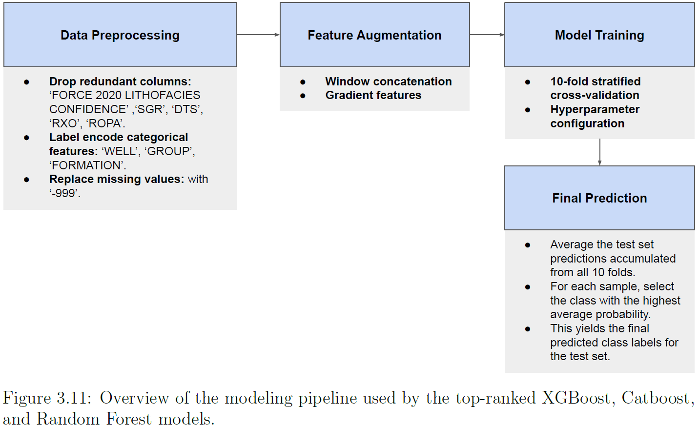

# Lithology Classification using Ensemble Learning Techniques
This repository contains the codes for lithology classification using three ensemble learning techniques: XGBoost, CatBoost, and Random Forest. 
I used these to perform a comparative study in Chapter 3 of my Master's thesis: https://www.proquest.com/docview/3240874881

## 📌 Project Overview

Lithology classification is the process of identifying and categorizing rock types into distinct geological facies using geophysical well log data. It is a critical step in reservoir characterization and stratigraphic analysis. 

This project demonstrates how ensemble learning techniques can automate this process with high precision, comparing a baseline (XGBoost) implementation against models optimized with **feature augmentation** to improve classification accuracy.

## 📊 Dataset Description
The models are trained and validated using the dataset from the **FORCE 2020 Lithology Competition**, one of the most comprehensive open-source datasets for petrophysical machine learning.

* **Training Set:**
    * Data from **98 wells**.
    * **1,170,511 samples** with 29 columns of geophysical data.
    * Recorded at a resolution of **0.152m**.
* **Test Set:**
  * Data from **10 wells** (utilizing the `hidden_test.csv` file from the competition).
* **Source:** [FORCE 2020 Machine Learning Competition](https://github.com/bolgebrygg/Force-2020-Machine-Learning-competition/tree/master/lithology_competition)

* **Implementation Pipleline Figure**:

